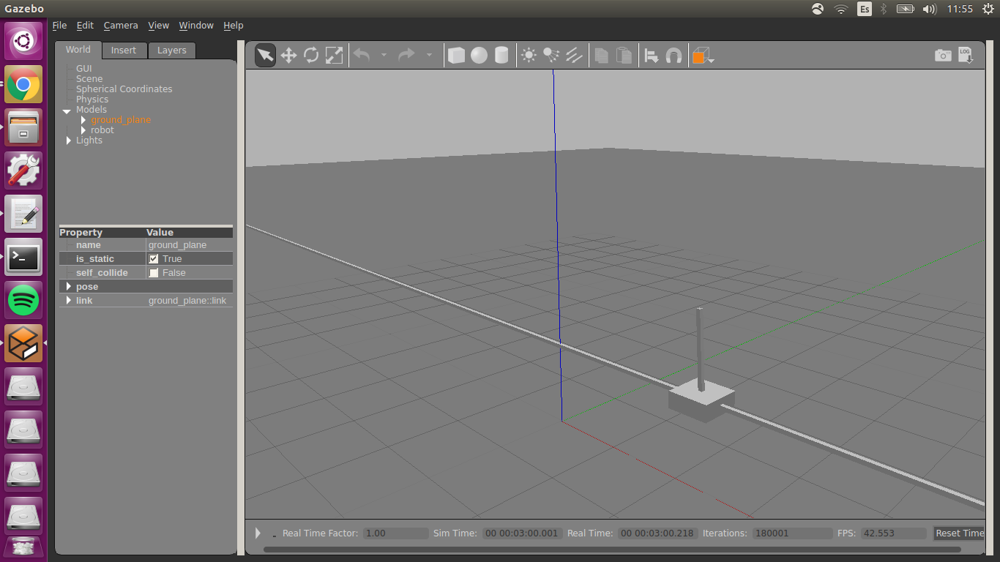

# gym_gazebo_tests

Silly repository to test the [Gazebo simulator](http://gazebosim.org/) along with the learning engine [gym_gazebo](https://github.com/erlerobot/gym-gazebo), developed by [Erle Robotics](https://acutronicrobotics.com/), which combines the strengths of Gazebo and [OpenAI Gym](https://github.com/openai/gym).

This is just me playing with these tools today. This repository is going to age very badly as I'm not forking and it's extremely dependent of third-party packages and repositories. In fact it's just that: packages and repositories developed and mantained by others. I'm just adding a Dockerfile that works for me. I may delete this repository in a near future.

This docker image uses directly your X server to display all the GUI applications running on the containers. There are safer ways to do it, but this worked pretty well and I just wanted to jump into the good stuff.

So far, I've just played with the Cartpole model. I'll be adding more as I learn.




## Installation

You need to have [Docker](https://docs.docker.com/install/) installed.

Once you have it, clone the repository and build the docker image (this will take a lot of time... 4.19GB to be installed).

```
git clone https://github.com/alesolano/gym_gazebo_tests
cd gym_gazebo_tests
sudo docker build -t gym_gazebo_cartpole .
```

## Setup

Create a container
```
sudo docker run --rm -d -t \
    --env="DISPLAY" \
    --volume="/tmp/.X11-unix:/tmp/.X11-unix:rw" \
    --name=container_0 \
    gym_gazebo_cartpole
```

Now, open a shell of the container
`sudo docker exec -it container_0 bash`

There, run gym-gazebo
`python ~/gym-gazebo/examples/gazebo_cartpole/gazebo_cartpole_v2.py`

Once Gazebo is loaded, in another terminal, open another shell of the container.
`sudo docker exec -it container_0 bash`

There, start the controller of the cartpole.
```
rosservice call /controller_manager/load_controller "name: 'cart_pole_controller'"
rosservice call /controller_manager/switch_controller "{start_controllers: ['cart_pole_controller'], stop_controllers: [], strictness: 2}"
```


**Enjoy**


Once you've finished, don't forget to stop the container (it will be automatically removed after that).
`sudo docker stop containter_0`
